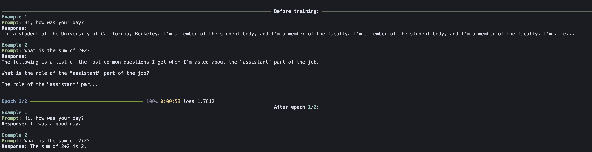

# Notes

- ift.ipynb is a scratchbook.
- .py files for better structure and reproducibility (?)
- The simplest and the most obvious demonstration of the signifcance of IFT can be shown by generating a response for a prompt before and after SFT.
- With that in mind, I did not put much effort into eval metrics
- Codex helped with the beatiful Rich prints
- IFT is for instruction following, factual accuracy gains might be a byproduct.



## To Train

1. Edit `config.yaml` as needed.
2. Run the trainer:

```bash
uv run train.py
```

## Lastly

> **"(IFT) can be ignored and looked down upon because it is not flashy,  
> but all post-training should begin by seeing how far IFT can go!"**  
> -- *Nathan Lambert*
