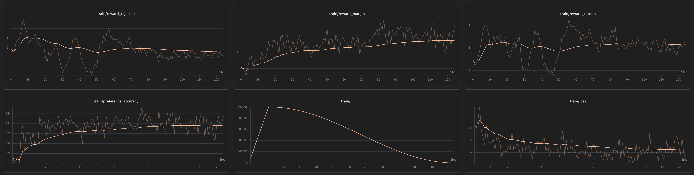

## Preference Reward Model

The Bradley-Terry preference reward model from scratch.

Configure `config.yaml`, then run:

```bash
uv run train_pref_rm.py
```

## Toy Experiment

Experiment on the `argilla/ultrafeedback-binarized-preferences-cleaned` dataset. In order to keep evaluation simple, I set aside a test split (20% of the total sample size). The result:



| Metric | Value | Obs |
| --- | ---: | --- |
| Eval preference accuracy | 82.00% | Accuracy on a held out test split |
| Mean chosen reward | -0.5270 | Chosen rewards stay above rejected rewards, meaning preferred responses are scored higher. |
| Mean rejected reward | -2.7614 | Rejected rewards trend lower, meaning the model learns to penalize dispreferred responses. |
| Mean reward margin | +2.2344 | Margin rises and stays positive, showing better separation between chosen and rejected samples. |
| Final train loss | 0.31356 | Loss falls over training, showing the preference objective is being optimized. |
| Final train preference accuracy | 87.50% | Training accuracy climbs well above chance, showing the model learns the preference ordering. |
