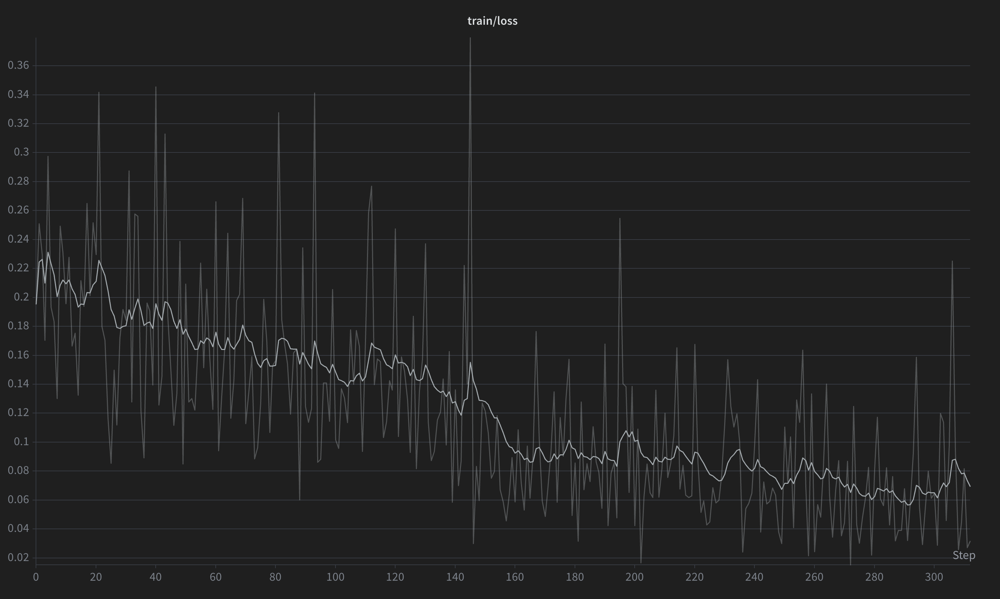
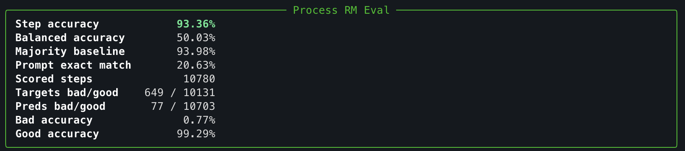
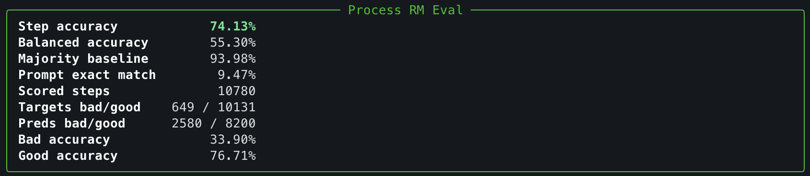

## Process Reward Model

A step-level process reward model (PRM) from scratch. Instead of scoring a whole
response (as the [preference RM](../preference_rm/README.md) does), a PRM scores
each *reasoning step* as good or bad, so it can localise *where* a solution goes
wrong.

### Approach

- Base model `Qwen/Qwen3-0.6B-Base` in BF16 with a linear classification head
  (`hidden_size → 2`, classes `bad` / `good`).
- Each training example is `Problem: ... \nReasoning trace:\n` followed by the
  steps, joined by a `\n<step>\n` separator.
- Only the **step-terminator token** (the last token of each step's separator)
  carries a label; every other token is masked with `-100`. The head is trained
  with cross-entropy on those terminator positions only — it learns to emit a
  per-step good/bad judgement at each step boundary.
- Data is `trl-lib/prm800k` (a cleaned `openai/prm800k`). Long traces are chunked
  (`max 20 steps`, `max 4096 tokens`) to bound memory.

Run training + eval:

```bash
uv run train_prm.py
```

Evaluate the untrained base model (random head) as a baseline:

```bash
uv run train_prm.py --evalonly
```

Hyperparameters live as module constants at the top of `train_prm.py`.

## Toy Experiment

Trained on 5,000 examples for 1 epoch (`lr 2e-5`, batch 2 × grad-accum 8,
cosine schedule, 5% warmup, seed 42). Training loss falls from ~0.20 to ~0.07
over ~310 optimizer steps:



The PRM800K test split is **heavily imbalanced** — most steps are labelled
`good` (10131) and only a few are `bad` (649), i.e. ~94% good. This is the single
most important fact for reading the metrics below: a model that blindly says
"good" everywhere already scores ~94% raw accuracy.

**Untrained base model** (random head) — `base_model_eval.png`:



**Trained model** — `train_prm_eval.png`:



| Metric | Base (untrained) | Trained | Obs |
| --- | ---: | ---: | --- |
| Step accuracy | 93.36% | 74.13% | Raw accuracy *drops* after training — but this is misleading (see below); both are below the 93.98% majority baseline. |
| Balanced accuracy | 50.03% | **55.30%** | Untrained ≈ chance (50%); training lifts it above chance — the model learns real signal. |
| Majority baseline | 93.98% | 93.98% | Accuracy of always predicting `good`. The bar that raw accuracy must be read against. |
| Prompt exact match | 20.63% | 9.47% | Fraction of full traces with *every* step correct. Inflated for the base model by its always-`good` bias. |
| Bad accuracy (recall) | 0.77% | **33.90%** | The headline result: the untrained model catches almost no errors; the trained model catches ~1 in 3. |
| Good accuracy (recall) | 99.29% | 76.71% | Trade-off — the trained model gives up some `good` recall to gain `bad` recall. |
| Preds bad/good | 77 / 10703 | 2580 / 8200 | Untrained predicts `good` almost always; trained model is willing to flag `bad`. |

## About the metrics

Because of the heavy class imbalance there are some nuances to the metrics used.
(Blindly saying `good` already scores ~94%).

**Good indicators:**

- **Balanced accuracy** — mean of per-class recall, so it's immune to the
  imbalance: 50% = chance, higher = real discrimination. The primary metric.
- **Bad accuracy** — recall on the `bad` class: of all truly bad steps, how many
  the model flags. This is the PRM's whole job (catching errors), and the number
  that best captures the effect of training.
- **Majority baseline** — always-predict-`good` (93.98%); the reference line
  without which raw accuracy is meaningless.

### Takeaway

Judge the PRM by **balanced accuracy** and **bad-class recall**, not step accuracy
or prompt exact match. The untrained model's higher headline accuracy (93% vs 74%)
is an artifact of the imbalance i.e., it's a constant `good` predictor at chance-level
balanced accuracy. Training takes the model from no discriminative ability to
catching a third of all errors. Next improvement: precision on `bad` (fewer false
positives).
